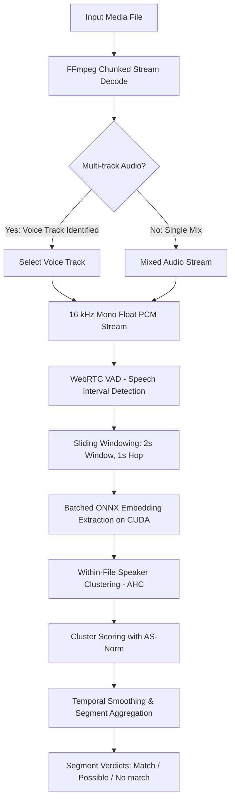

# VoiceScan System Design

## 1. Product Description
VoiceScan is a fully local, privacy-first cross-platform (Windows + Linux) application and high-performance CLI engine designed to enroll a person's voice and scan long audio and video recordings (primarily gameplay captures where multiple players' voice chat is mixed with game audio, music, and sound effects) to pinpoint exactly where that specific person speaks, or verify their absence.

### Core Principles
- **100% Offline & Private:** Zero network calls, zero telemetry, and zero third-party cloud dependencies at runtime. Protects sensitive biometric voice data and complies with strict privacy standards (e.g., UK GDPR Special Category biometric data).
- **Fast Enrollment:** Uses pre-trained speaker verification embeddings rather than per-user model training. Enrolls a voice profile in seconds by averaging embeddings from short clean reference clips.
- **Hardware Acceleration:** Native C#/.NET engine for Windows and Linux utilizing ONNX Runtime with the NVIDIA CUDA execution provider for high-throughput batch inference. The default build is CPU-only; build with `-p:VoiceScanGpu=true` (CUDA 12 + cuDNN 9) for GPU, and the app shows a banner whenever inference runs on CPU.
- **Reproducible Evaluation:** All operational claims and decision thresholds are anchored in an automated evaluation harness with statistical confidence bounds.

---

## 2. Verdict Model: Match / Possible / No Match
Raw similarity scores and binary thresholds are brittle in mixed gameplay audio due to acoustic clutter, shouting, background game dialogue, and codec artifacts. VoiceScan employs a 3-tier verdict model supplemented with diagnostic reason flags:

```
Score Distribution:
[ 0.0 -------------- T_possible -------------- T_match -------------- 1.0 ]
       No Match               Possible                  Match
```

### Verdict Definitions
- **Match:** High-confidence detection where segment similarity exceeds upper threshold $T_{\text{match}}$ with continuous temporal support and strong cluster purity.
- **Possible:** Ambiguous signal where similarity falls between $T_{\text{possible}}$ and $T_{\text{match}}$, or where a high score occurs under challenging acoustic conditions. Triaged for human verification.
- **No Match:** High confidence that the target speaker is absent across all speech segments in the file.

### Diagnostic Reason Flags
For any segment flagged as `Possible` (and low-confidence `Match`), the engine attaches diagnostic reason flags:
- `LOW_SNR`: Estimated signal-to-noise ratio is low (speech masked by heavy game noise, explosions, or soundtrack).
- `SHORT_SEGMENT`: Speech duration is under minimum duration (e.g. $< 1.0\,\text{s}$), reducing embedding stability.
- `CODEC_DEGRADATION`: Extreme compression artifacts (e.g. low-bitrate Opus Discord stream).

---

## 3. End-to-End Processing Pipeline



### Pipeline Stages
1. **Decode:** FFmpeg streams audio directly to 16 kHz mono 32-bit float PCM in chunks into a disk spool under `LocalApplicationData/VoiceScan/spool` (not the system temp directory, which is often RAM-backed), so memory stays bounded for multi-hour files. A decode that FFmpeg reports as failed is an error, never a shorter file.
2. **Optional Multi-Track Select:** Media containers (MKV, MP4) are inspected for multiple audio tracks. If a dedicated voice-chat or microphone track is present (standard in OBS multi-track recording), the engine selects it directly, bypassing background game separation.
3. **Voice Activity Detection (VAD):** A bit-exact C# port of the Google WebRTC VAD (two-Gaussian speech/noise model over six sub-band energies, adaptive noise tracking) classifies 30 ms frames; runs shorter than 0.25 s are dropped, gaps under 0.3 s are bridged and intervals are padded by 30 ms. Like the reference, it labels stationary noise and steady tones as speech, so it removes silence and quiet background rather than all game audio; clustering and scoring handle the rest.
4. **Windowing:** Fixed 2.0-second sliding windows with a 1.0-second hop (50% overlap) extracted strictly across active speech regions.
5. **Speaker Embedding Extraction:** Batched ONNX Runtime inference converts each speech window into a unit-normalized vector. Supported models are SpeechBrain ECAPA-TDNN (default) and NVIDIA NeMo TitaNet-Small, each fed the exact feature front-end it was trained with (`SpeechFeatures`: SpeechBrain `Fbank` in dB with sentence mean normalization; NeMo log-mel with per-feature normalization), verified against the reference implementations. Each model has its own measured operating point (match threshold, clustering distance).
6. **Within-File Speaker Clustering:** Agglomerative Hierarchical Clustering (AHC, average linkage) clusters all window embeddings within the file into speaker identities. A cluster centroid embedding is computed per speaker. Scoring clusters rather than individual noisy windows eliminates single-frame false alarms. Files with more than 2,000 windows are clustered in contiguous blocks whose clusters are then agglomerated again with the same rule, so memory stays bounded for any recording length.
7. **Cluster Scoring with Score Normalization:** Cosine similarity between target profile centroid and file cluster embeddings. Adaptive Symmetric Score Normalization (AS-Norm) calibrates similarity scores against a pre-indexed cohort of non-target impostor embeddings.
8. **Temporal Smoothing & Segment Aggregation:** Window-level and cluster-level scores are mapped back to audio timestamps. Adjacent hits within $\Delta t_{\text{merge}}$ (e.g., 0.5s) are merged into continuous speech turns. Isolated single-window spikes lacking temporal support are discarded.
9. **Verdict & Segment Generation:** Output formatted as timestamped segments with start/end times, verdict classification, confidence score, and reason flags. Confidence is the cluster cosine similarity to the profile, or a fixed sigmoid of the AS-Norm z-score when a cohort is supplied; it is not a calibrated probability until a calibration is fitted on labelled real-speech trials.

---

## 4. Embedding Cache Architecture

Scanning multi-hour libraries for multiple voice profiles requires fast re-scan capabilities. The embedding cache decouples heavy audio decoding and neural extraction from target profile matching.

```
+--------------------------------------------------------------------------------+
| Cache Key = SHA256( FileHash + ModelVersion + VADSettings + WindowSettings )    |
+--------------------------------------------------------------------------------+
                                       |
                                       v
                    +------------------------------------+
                    |        SQLite Local Storage        |
                    |  - Window Timestamps (Start, End)  |
                    |  - High-dimensional Embedding Blocs|
                    |  - Speech Energy & VAD Metadata    |
                    +------------------------------------+
```

### Design Invariants
1. **Deterministic Cache Keying:**
   - `FileHash`: Hybrid file hash (file size + head/tail 1MB samples + periodic block sampling, with optional full SHA-256 validation).
   - `ModelVersion`: Model id, SHA-256 prefix of the weights and feature front-end fingerprint (e.g. `speechbrain-ecapa-tdnn@75f5f36d2387+sb-fbank80-v1`). Voice profiles record the same value; a profile is only scanned with the exact model version that enrolled it.
   - `VADSettings`: VAD algorithm and mode, minimum speech/silence and padding.
   - `WindowSettings`: Window duration (2.0s) and hop step (1.0s).
2. **Instant Multi-Profile Re-Scan:** When scanning a new voice profile against a previously processed audio collection, Stages 1 through 5 are skipped. Embeddings are read directly from SQLite, reducing scan duration from minutes to seconds per file.
3. **Invalidation Semantics:** Changing model architecture, weights, or windowing invalidates cached embeddings. Adding or updating a voice profile invalidates only scoring verdicts.

---

## 5. Success Metrics & Evaluation Standards

Per-window error rates (e.g., standard EER) are unrepresentative for long-form gameplay audio: in a 10-hour recording (~36,000 windows), a 1% false alarm rate produces 360 false detections. VoiceScan measures performance at the file and segment level.

### Target Performance Gate

| Metric | Target (SNR $\ge 10\,\text{dB}$) | Target (SNR $0\text{--}10\,\text{dB}$) |
|---|---|---|
| **False Alarms per Hour (FA/hr)** | $\le 1.0$ false hit / hr | $\le 3.0$ false hits / hr |
| **Per-File Recall** | $\ge 90\%$ target present | $\ge 75\%$ target present |
| **Per-File Precision** | $\ge 90\%$ | $\ge 80\%$ |
| **End-to-End Processing Speed** | $\ge 30\times$ realtime (GPU) | $\ge 30\times$ realtime (GPU) |

### Evaluation Rigor
- **Stratified SNR Buckets:** Metrics must be reported separately across four SNR buckets: Clean ($\ge 20\,\text{dB}$), Moderate ($10\text{--}20\,\text{dB}$), Low ($0\text{--}10\,\text{dB}$), and Harsh ($-5\text{--}0\,\text{dB}$).
- **Degradation Matrices:** Breakdown by Opus codec compression (16, 24, 32, 64 kbps), automatic gain control (AGC), and background noise type.
- **Statistical Uncertainty:** Every reported metric must include non-parametric **95% Bootstrap Confidence Intervals** calculated across speakers and files. Single headline numbers without confidence intervals are rejected.

---

## 6. Desktop UI & Evidence Reporting

The user application layer (`/app`) provides an Avalonia UI (Fluent theme, dark by default with a light toggle) interface built upon the headless `VoiceScan.Core` engine, decoupled into 4 screens plus a first-run setup window. The setup window appears only when the ONNX models or FFmpeg are missing, lists exactly what is missing and lets the user copy model files into `LocalApplicationData/VoiceScan/models`. Profiles, the embedding cache and review data live under `LocalApplicationData/VoiceScan`.

1. **Enrollment Wizard (`EnrollmentWizardView`):**
   - Audio or video file import; the quality check runs automatically after a file is chosen.
   - Enforced ethical and legal consent gate (`HasConsent == true`).
   - Plain-language audio quality verification (speech duration $\ge 4.0\,\text{s}$, SNR check, background noise level).
   - Saves a named voice profile (`.json`) to the per-user profiles folder, then moves to the Scan screen with it selected. A fresh install opens on this screen.

2. **Scan Dashboard (`ScanView`):**
   - Audio folder picker and a drop-down of saved voice profiles.
   - Real-time scanning progress: per-file status, overall ETA, processing speed multiple ($\ge 10\times\text{--}50\times$), GPU / CPU device indicators.
   - Asynchronous cancellation and resume mechanisms.

3. **Results & Timeline (`ResultsView`):**
   - File listing with tri-state verdict badges (`Match`, `Possible`, `No match`).
   - Interactive waveform timeline rendering hit segments, confidence scores, and diagnostic reason flags.
   - Audio player with scrubbing cursor and click-to-play at hit timestamps.

4. **Review Queue & Active Learning (`ReviewView`):**
   - Human-in-the-loop review interface: Confirm or Reject segment hits.
   - Confirmed segments are added (as one embedding each) to the voice profile they were scanned against, and the centroid is recomputed as the mean of all profile embeddings.
   - Decisions are stored per voice and segment in SQLite (`ReviewDatabase`).

5. **Evidence Report Export & Local Auditing (`EvidenceReportExporter`):**
   - Forensic-grade audit reports exported directly in PDF 1.4 and CSV formats.
   - Per-segment audit fields: media hash, timestamps, verdict, confidence, reason flags, scan errors, audio track, profile name, model version, the settings snapshot of the scan that produced the results, and its start time. CSV fields are quoted and spreadsheet formulas neutralized.
   - Hit audio slicer extracting 16 kHz WAV audio clips into `audio_hits/` for immediate playback and external review.
   - Thread-safe local file logging to `LocalApplicationData/VoiceScan/logs/voicescan.log` with automatic CUDA fallback warnings and error recovery.

